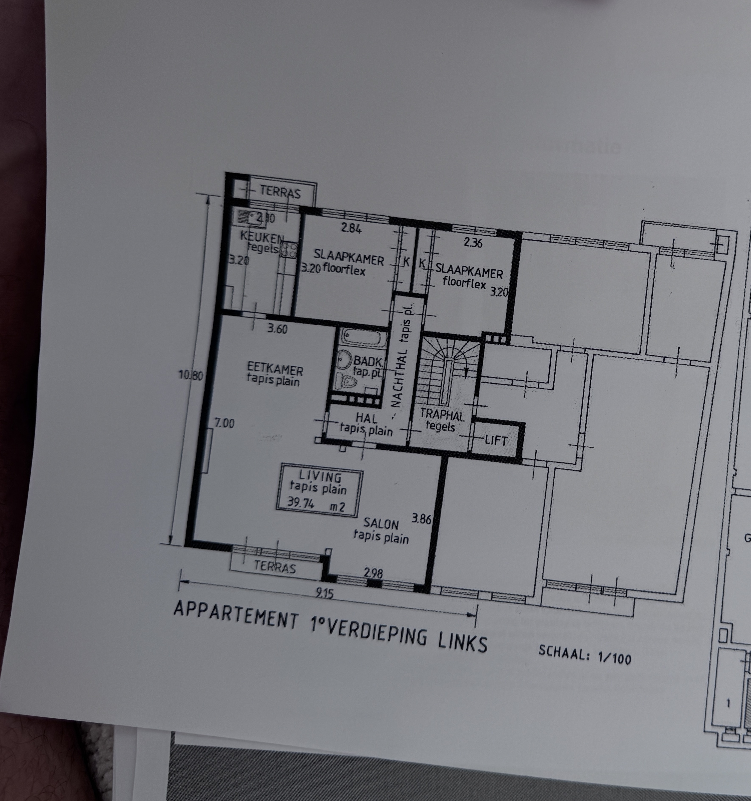

# Appartement Maastrichtersteenweg — interactieve 3D-plattegrond

Een interactieve, op schaal gereconstrueerde 3D-render van het **appartement 1e
verdieping links** (schaal 1/100), gebouwd met [Three.js](https://threejs.org/).
Geen build-stap nodig — het is één statische pagina.



## Openen

Omdat de pagina lokale scripts laadt, open je hem via een kleine webserver
(dubbelklikken op `index.html` werkt niet in alle browsers vanwege
`file://`-beperkingen):

```bash
# vanuit de projectmap
python3 -m http.server 8000
# open daarna http://localhost:8000
```

## Bediening

| Modus | Bediening |
|-------|-----------|
| 🔄 **Overzicht** (orbit) | Sleep om te draaien · scroll/knijp om te zoomen · rechtermuisknop om te pannen |
| 🚶 **Rondlopen** (first-person) | **Sleep** (muis of vinger) om rond te kijken · **WASD** / pijltjes of de on-screen knoppen om te bewegen · **Shift** = sneller |
| **Plafond aan/uit** | Verberg het plafond voor een dollhouse-overzicht |

Werkt op desktop én touch/mobiel.

## Afmetingen (uit de plattegrond, schaal 1/100)

- **Buitenmaat:** 9,15 m (breedte) × 10,80 m (diepte), verdiepingshoogte 2,60 m
- **Living / Salon:** 39,74 m² (tapis plain, open plan met eetkamer)
- **Eetkamer:** 3,60 m breed (tapis plain)
- **Keuken:** 2,10 × 3,20 m (tegels)
- **Slaapkamer 1:** 2,84 × 3,20 m (floorflex)
- **Slaapkamer 2:** 2,36 × 3,20 m (floorflex)
- **Badkamer** (bad, wc, wastafel), **Hal**, **Nachthal** — tapis plain / tegels
- **Traphal + lift** (gemeenschappelijk, tegels) in de zuidoosthoek
- **2 terrassen:** bij de keuken (noord) en bij de living (zuid)

De vloertypes uit de plattegrond (*tapis plain*, *tegels*, *floorflex*) zijn met
verschillende kleuren weergegeven — zie de legende in de app.

## Reconstructie & aannames

De maatvoering volgt de op de plattegrond vermelde afmetingen. Waar de plattegrond
geen exacte maat gaf (posities van enkele binnenmuren, deur- en raamopeningen,
meubelplaatsing) is een redelijke, proportioneel kloppende invulling gekozen. Het
meubilair is bewust gestileerd (eenvoudige volumes) en dient ter indicatie van
functie en schaal, niet als exacte weergave.

## Structuur

```
index.html            # pagina + UI (knoppen, legende, besturing)
app.js                # 3D-model: muren, vloeren, ramen, deuren, meubels, camera's
vendor/three.min.js   # Three.js r128
vendor/OrbitControls.js
docs/                 # originele + uitgesneden plattegrond
```

## Bron

Plattegrond: Limburgse Woningcentrale (lwc.be) — appartement 1e verdieping links,
Maastrichtersteenweg. Zie `docs/plattegrond-origineel.jpg`.
